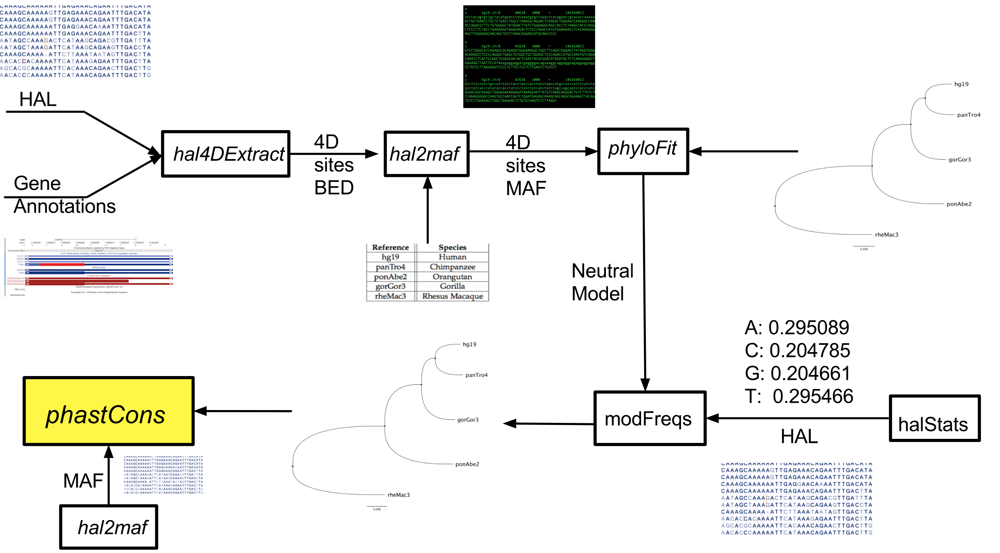
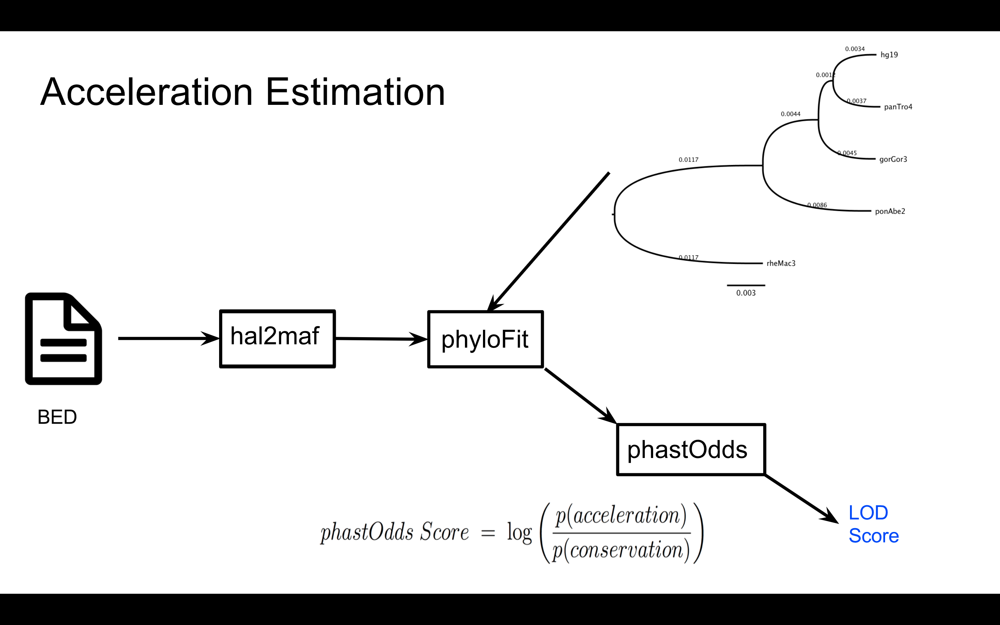

# Accelerator
> This repository provides a pipeline for inferring human evolutionary accelerated regions. Note, it's primary purpose is to demonstrate and document the code used to identify these regions. The pipeline run by `python run_accelerator.py` has not yet been thouroughly tested. The Python code is intended for an individual who would like to further build upon and test this pipeline. 

## Dependencies:
> * [HAL](https://github.com/ComparativeGenomicsToolkit/hal) 
> * [Phylogenetic Analysis with Space/Time Models](http://compgen.cshl.edu/phast/) 

## The pipeline
> This pipeline begins with a HAL file generated from a whole genome [cactus](https://github.com/ComparativeGenomicsToolkit/cactus) alignment. It then uses programs from the HAL and PHAST toolkits to infer evolutionary accelerated regions. It begins by estimating conserved genomic regions, a conserved phylogenetic model, and non-conserved phylogenetic model.  

Filtering of non single copy regions in the dataset is then performed on the conserved regions. To determine the strength of the candidate accelerated data the following pipeline is then performed to estimate log odds ratio scores.

## Important Files
