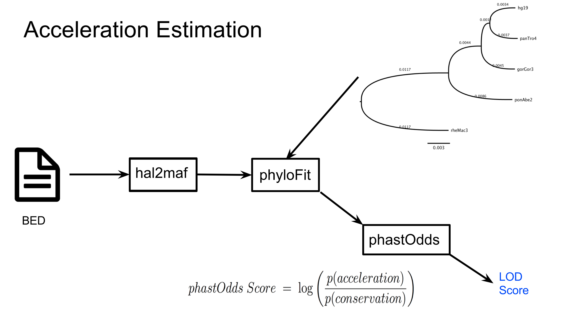

# Accelerator
> This repository provides a pipeline for inferring human evolutionary accelerated regions. Note, it's primary purpose is to demonstrate and document the code used to identify these regions. The pipeline run by `python run_accelerator.py` has not yet been thouroughly tested. That Python code is intended for an individual who would like to further build upon and test a fully automated version of this pipeline. 

## Dependencies:
> * [HAL](https://github.com/ComparativeGenomicsToolkit/hal) 
> * [Phylogenetic Analysis with Space/Time Models](http://compgen.cshl.edu/phast/) 
> * [bedtools](http://bedtools.readthedocs.io/en/latest/content/bedtools-suite.html)

## The pipeline
> This pipeline begins with a HAL file generated from a whole genome [cactus](https://github.com/ComparativeGenomicsToolkit/cactus) alignment. It then uses programs from the HAL and PHAST toolkits to infer evolutionary accelerated regions. It begins by estimating conserved genomic regions, a conserved phylogenetic model, and non-conserved phylogenetic model.  

Filtering of non single copy regions in the dataset is then performed on the conserved regions. To determine the strength of the candidate accelerated data the following pipeline is then performed to estimate log odds ratio scores.

## Important Files in ./accelerate/scripts
* check_regions.py  - estimates log odds scores by reading a BED file from stdin
* compute_subs.py - generated MAFs for each region in a BED file and then computes substitution rates between humans and primate ancestors. 
* hist_substitution_rates.py - creates a histogram of substitution rates
* multi_get_single_copy.py - calculates single copy percentages for regions in a BED file provided that a single copy regions BED file is also provided. These single copy region BED files can be obtained through running the program `halSingleCopyExtract` from the HAL toolkit.
* how_well_did_we_do.py - checks coverage in both genomic sequences and coding sequences
* find_accelerated_regions.py - computes log odds ratio scores and performs phylogenetic model rescaling from a conserved BED file. This can be used as a more strict alternative to check_regions.py
* plot_coverage_roc.py - plots coverage in either genomic sequences or coding sequences 
